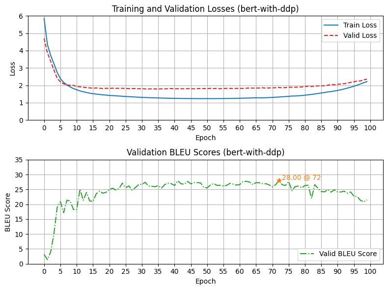

<h1 align="center" style="font-weight: bold;">transformer 👋🤖</h1>

<p align="center">
    <a href="#-getting-started">🚀 Getting Started</a> -
    <a href="#-usage">🧑‍💻 Usage</a> -
    <a href="./CHANGELOG.md">📙 Changelog</a> -
    <a href="#-maintainers">👥 Maintainers</a> -
    <a href="#-contributing">🤝 Contributing</a> -
    <a href="#-license">📄 License</a>
</p>

<p align="center">
    <!-- Project maintenance status -->
    
    
    
    
    </br>
    <!-- Project development environment -->
    
    
    
    </br>
    
    
    
    
    </br>
    <!-- Documentation -->
    
    
    
</p>


## 📦 About The Project

> 📃 Original Paper: [《Attention Is All You Need》](https://arxiv.org/abs/1706.03762)

### Introduction

This project reproduces **Basic Transformer Architecture** by **PyTorch** in 《Attention Is All You Need》. Train transformer model in Multi30k dataset (DE2EN), and archieved a maximum BLEU score of 28-29.
- *Tokenizer*: BERT / SpaCy (configurable);
- *Training Mode*: DDP / Non-DDP (configurable);
- *Training Method*: Teacher Forcing;
- *Evaluate Method*: Auto-regressive;
- *Evaluate Metric*: Corpus BLEU Score;

### Training Trace (Loss/PPL/BLEU)

<div align="center">
    
</div>


### Prediction Trace

```txt
[[[Input Prompt]]]:             Ein Mann mit beginnender Glatze, der eine rote Rettungsweste trägt, sitzt in einem kleinen Boot.
[[[Reference]]]:                a balding man wearing a red life jacket is sitting in a small boat.

[[[Transformer Hypotheses]]]:
Epoch 00----------------a man in a with a with a with a with a with a with a with a with a with a with a with a with a with a with a with a with a with a with a with a with a with a.
Epoch 01----------------a man in a blue shirt is wearing a blue shirt is wearing a blue shirt is wearing a blue shirt, wearing a blue shirt is is is sitting with a man, with a man, wearing a man with a man with a man with a man with a man, wearing a man, wearing a man with a man with a man with a man with a man with a man with a man with a man with a man with a man with a man with a man with a man with a man with a man with a man with a man with a man with a man with a man with a man with a man with a man with a man with a man with a man with a man with a man with a man with a man with a man with a man with a man with a man with a man with a man with a man with a man with a man with a man with a man with a man with a man with a man with a man with a man with a man with a man with a man with a man with a man with a man with a man with a man with a man with a man with a man with his - - - - - - - - - - - - with his - - - - - with his - with his
Epoch 02----------------a man in a red shirt is sitting on a red hat with a red hat with his hat with his hat.
Epoch 03----------------a man wearing a red hat is sitting on a red chair with a red car....
Epoch 04----------------a man wearing a long - hair is sitting in a red boat with a small boat..
Epoch 05----------------a man wearing a bright red vest is sitting in a small boat..
Epoch 06----------------a bald man wearing a red vest is wearing a red vest is sitting in a small boat.
Epoch 07----------------a balding man wearing a red life jacket is sitting in a small boat..
Epoch 08----------------a balding man wearing a red life jacket is sitting in a small boat.
Epoch 09----------------a bald man wearing a red life jacket is wearing a red life jacket is sitting in a boat.
Epoch 10----------------a balding man wearing a red life vest is sitting in a small boat..
Epoch 15----------------a bald man wearing a red life vest sits in a small boat....
Epoch 20----------------a balding man wearing a red life jacket is sitting in a small boat..
Epoch 25----------------a balding man wearing a red life jacket is sitting in a small boat..
Epoch 30----------------a balding man wearing a red life jacket sits in a small boat...
Epoch 35----------------a balding man wearing a red life jacket sits in a small boat...
Epoch 40----------------a balding man wearing a red life vest is sitting in a small boat...
Epoch 45----------------a balding man wearing a red life vest is sitting in a small boat...
Epoch 50----------------a balding man wearing a red life vest is sitting in a small boat...
Epoch 55----------------a balding man wearing a red life vest is sitting in a small boat..
Epoch 60----------------a balding balding in a red life jacket sits in a small boat..
Epoch 65----------------a balding man wearing a red life vest is sitting in a small boat....
Epoch 70----------------a balding man wearing a red life vest is sitting in a small boat..
Epoch 75----------------a balding man in a red life vest is sitting in a small boat...
Epoch 80----------------a balding man wearing a red life vest is sitting in a small boat...
Epoch 85----------------a balding man wearing a red life vest is sitting in a small boat...
Epoch 90----------------a balding man wearing a red life vest is sitting in a small boat...
Epoch 95----------------a balding man wearing a red life vest is sitting in a small boat...
```


## 🚀 Getting Started

### Device Requirements

- At least one Nvidia GPU (>= 8GB GPU Memory);

### Install Dependencies

Create a Python 3.9.23 environment (use venv or conda), and then install dependencies:
- Install PyTorch: https://pytorch.org/
- Install SpaCy tokenizers:
    ```bash
    pip index versions spacy
    python install spacy==3.7.0

    python -m spacy download de_core_news_sm
    python -m spacy download en_core_web_sm
    ```
- Install other dependencies:
    ```bash
    pip install -r requirements-py3.9.23.txt
    ```

### Check If Runnable

```bash
bash ./scripts/test_runnable.sh
```


## 🧑‍💻 Usage

### Pre-Training

Modify `./src/configs.py` or `./src/train.py` for your data / model / training / save configurations.

Then, train model:
- **Single-node single-GPU (no DDP)**:
    ```bash
    python -u -m src.train
    ```
- **Single-node single-GPU Training (DDP)**:
    ```bash
    torchrun --nnodes=1 --node_rank=0 --nproc_per_node=4 -m src.train
    ```

Also, you can use scripts to train transformer:
```bash
bash ./scripts/train.sh
```


## 👥 Maintainers

[@OrangeByte42](https://github.com/OrangeByte42).


## 🤝 Contributing

<a href="https://github.com/OrangeByte42/photo-archiver/graphs/contributors">
  
</a>


## 📄 License

[GPL3](./LICENSE) © OrangeByte42


## 🙏 Acknowledgments

Thanks to:
- [hyunwoongko/transformer](https://github.com/hyunwoongko/transformer)

